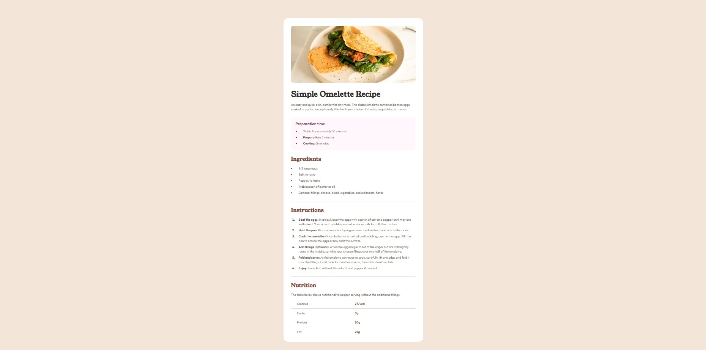

# Frontend Mentor - Recipe page solution

This is a solution to the [Recipe page challenge on Frontend Mentor](https://www.frontendmentor.io/challenges/recipe-page-KiTsR8QQKm). Frontend Mentor challenges help you improve your coding skills by building realistic projects.

## Table of contents

- [Overview](#overview)
  - [Screenshot](#screenshot)
  - [Links](#links)
- [My process](#my-process)

  - [Built with](#built-with)
  - [What I learned](#what-i-learned)

- [Author](#author)

## Overview

### Screenshot

### Links

- Solution URL: [Go to solution](https://www.frontendmentor.io/solutions/recipe-page-solution-URcdVfGvtg)
- Live Site URL: [Go to live site](https://marcelocolodetti.github.io/desafiorecipepage/)

## My process

### Built with

- HTML5
- CSS

### What I learned

Useful project for recapping and fixing basic concepts such as semantics in HTML and properties in CSS.

## Author

- Frontend Mentor - [@MarceloColodetti](https://www.frontendmentor.io/profile/MarceloColodetti)
